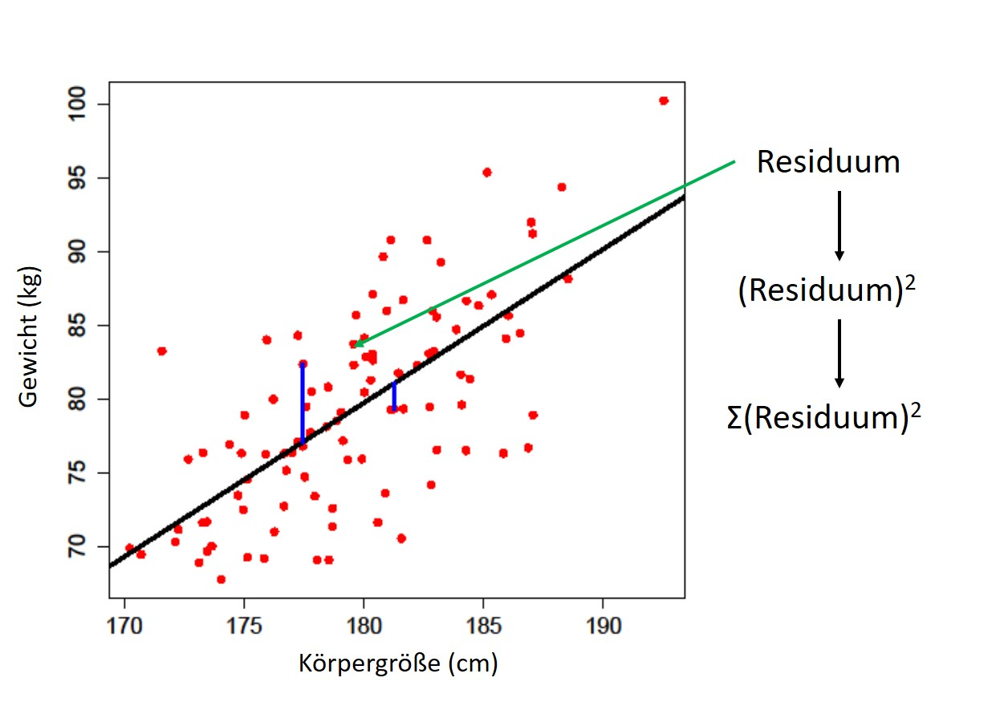
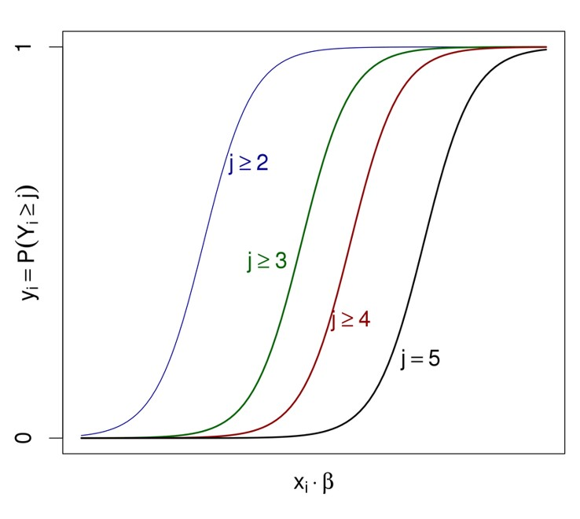

# Session Setup

```{r setup, echo=T, warning=FALSE, message=FALSE}
rm(list = ls())
time0<-Sys.time()

source("../sourceFile.R")
setwd(pathToExample)

knitr::opts_chunk$set(echo = TRUE)
```

# Lineare Regression 

In dem ersten Teil dieser Übung beschäftigen wir uns mit einfacher linearer Regression. 

## Wiederholung aus der VL

* Regresswerte = Vorhergesagte Werte: $\hat{y}_i = \hat{\beta}_0 + \hat{\beta}_1 x_i$ 
* Residuen = Abweichung Vorhersage - Beobachtung: $\hat{y}_i - y_i$
* Residual Sum of Square (RSS) = Summe der quadratischen Fehler: $\sum_{i=1}^n (\hat{y}_i - y_i)^2$
* Mean Square Error = Residuale Varianz: $\frac{1}{n} \sum_{i=1}^n (\hat{y}_i - y_i)^2$
* Lineares Regressionsmodell: $Y = \beta_0 + \beta_1 X_1 + ... + \beta_n X_n + \epsilon, \epsilon \sim N(0,\sigma^2)$

{width=70%}

Das heißt, bei der linaren Regression versucht man eine beobachtete abhängige Variable $y$ durch eine oder mehrere unabhängige Variablen $x$ zu erklären, wobei die RSS minimal werden soll. Im Falle einer einfachen linearen Regression mit je einer unabhängigen und einer abhängigen Variablen muss der Term 

$$RSS(\beta_0,\beta_1)=\sum_{i=1}^{n} [(\beta_0 + \beta_1 x_i)-y_i]^2$$

partiell für $\beta_0$ und $\beta_1$ abgeleitet werden. 

In R ist diese Rechnung in der Funktion *lm()* implementiert. Wir nutzen hier wieder den *iris* Datensatz als Beispiel.

```{r}
data(iris)

# Modell 1: Sepal.Length ~ Sepal.Width
mod1 = lm(Sepal.Length ~ Sepal.Width,data = iris)
summary(mod1)
summary(mod1)$coeff
ggplot(iris,aes(x=Sepal.Width,y=Sepal.Length)) +
  geom_point() +
  geom_smooth(method = 'lm',formula = 'y ~ x') +
  theme_bw() +
  scale_x_continuous('Kelchblattweite') +
  scale_y_continuous ('Kelchblattlänge')

# Modell 2: Sepal.Length ~ Petal.Length
mod2 = lm(Sepal.Length ~ Petal.Length,data = iris)
summary(mod2)
summary(mod2)$coeff
ggplot(iris,aes(x=Petal.Length,y=Sepal.Length)) +
  geom_point() +
  geom_smooth(method = 'lm',formula = 'y ~ x') +
  theme_bw() +
  scale_x_continuous('Blütenblattlänge') +
  scale_y_continuous ('Kelchblattlänge')

```

Wir sehen also, dass es einen signifikanten Zusammenhang zwischen der Kelch- und Blütenblattlänge gibt ($p=1.04x10^{-47}$), aber keinen zwischen Kelchlänge und -weite ($p=0.152$). 

Das lineare Modell von Kelch- und Blütenblattlänge lässt sich schreiben als

$$ Sepal.Lenght = \beta_0 + \beta_1 Petal.Length + \epsilon = 4.31 + 0.41 * Petal.Length + \epsilon, \epsilon \sim N(0,\sigma^2)$$

Dieses Modell erklärt 76% der Varianz der Kelchblattlänge ($r^2$ aus dem *summary* Aufruf). 

In diesem Datensatz werden jedoch 3 Spezies auf einmal betrachtet, und die Spezies hat ebenfalls einen Effekt auf die Kelchblattlänge. Um beide Variablen gleichzeitig zu analysieren, gibt es verschiedene Möglichkeiten:

* Multiple lineare Regression: $Sepal.Lenght = \beta_0 + \beta_1 Petal.Length + \beta_2 Species + \epsilon$
* Stratifizierte Analyse: $Sepal.Lenght_{Species} = \beta_{0,Species} + \beta_{1,Species} Petal.Length  + \epsilon$ pro Species
* Interaktionsanalyse: $Sepal.Lenght = \beta_0 + \beta_1 Petal.Length + \beta_2 Species + \beta_3 Petal.Length * Species + \epsilon$

Sowohl mit der stratifizierten als auch mit der Interaktionsanalyse können Interaktionseffekte zwischen *Petal.Length* und *Species* berücksichtigt werden. Bei der stratifizierten Analyse kann die Differenz der jeweiligen Schätzer verglichen werden, und bei der Interaktionsanalyse kann der Schätze $\beta_3$ mittels t-Test gegen 0 getestet werden. 

```{r}
ggplot(iris,aes(x=Petal.Length,y=Sepal.Length,col = Species)) +
  geom_point() +
  geom_smooth(method = 'lm',formula = 'y ~ x') +
  theme_bw() +
  scale_x_continuous('Blütenblattlänge') +
  scale_y_continuous ('Kelchblattlänge')
ggplot(iris,aes(x=Species,y=Sepal.Length,fill = Species)) +
  geom_boxplot() +
  theme(legend.position="none") +
  scale_x_discrete('Spezies') +
  scale_y_continuous ('Kelchblattlänge') 

mod3 = lm(Sepal.Length ~ Petal.Length + Species,data = iris)
mod4a = lm(Sepal.Length ~ Petal.Length,data = iris,subset = Species == "setosa")
mod4b = lm(Sepal.Length ~ Petal.Length,data = iris,subset = Species == "versicolor")
mod4c = lm(Sepal.Length ~ Petal.Length,data = iris,subset = Species == "virginica")
mod5 = lm(Sepal.Length ~ Petal.Length*Species,data = iris)

summary(mod3)$coeff
summary(mod4a)$coeff
summary(mod4b)$coeff
summary(mod4c)$coeff
summary(mod5)$coeff

```

Die Modelle 4a-c testen seperat pro Spezies den Effekt, während Modell 5 alle Spezies gemeinsam analysiert und auch auf Interaktion testet. Die Schätzer für Intercept und Steigung pro *Petal.Length* sind jedoch die gleichen:

$$ \left(\begin{array}{c} y_{setosa} \\ y_{versicolor} \\ y_{virginica} \end{array}\right)  = 4.21 + \left(\begin{array}{c} 0 \\ -1.81 \\ -3.15 \end{array}\right) + (0.54  + \left(\begin{array}{c} 0 \\ 0.29 \\ 0.45 \end{array}\right))  *x + \epsilon $$

Die letzten beiden Zeilen der Koeffizientenmatrix von Model 5 gibt die Interaktionseffekte an. Beide sind nicht signifikant. D.h. man kann die Nullhypothese von keiner Interaktion nicht ablehnen. 

Auch wenn man die stratifizierten Schätzer verwendet, gibt es keine signifikante Interaktion: 

```{r}
interactionTest = function (mean1, se1, mean2, se2) {
    meandiff_se = sqrt(se1^2 + se2^2)
    meandiff = mean2 - mean1
    meandiff_cilow = meandiff - 1.96 * meandiff_se
    meandiff_cihigh = meandiff + 1.96 * meandiff_se
    meandiff_z = meandiff/meandiff_se
    meandiff_p = stats::pnorm(abs(meandiff_z), lower.tail = F) * 2
    if (meandiff_p > 1) 
        meandiff_p = 1
    data.table::data.table(mean1, se1, mean2, se2, meandiff, 
        meandiff_se, meandiff_cilow, meandiff_cihigh, meandiff_z, 
        meandiff_p)
}
interactionTest(mean1 = summary(mod4a)$coeff[2,1],se1 = summary(mod4a)$coeff[2,2],
                mean2 = summary(mod4b)$coeff[2,1],se2 = summary(mod4b)$coeff[2,2])
interactionTest(mean1 = summary(mod4a)$coeff[2,1],se1 = summary(mod4a)$coeff[2,2],
                mean2 = summary(mod4c)$coeff[2,1],se2 = summary(mod4c)$coeff[2,2])
interactionTest(mean1 = summary(mod4c)$coeff[2,1],se1 = summary(mod4c)$coeff[2,2],
                mean2 = summary(mod4b)$coeff[2,1],se2 = summary(mod4b)$coeff[2,2])

```


# Logistische / Proportional Odds Regression

Bei der **logistischen Regression** (=logit Regression) werden binäre abhängige Variablen betrachtet, z.B. Erkrankung ja/nein. In der Regel werden diese beiden Ausprägungen mit 0 und 1 kodiert, sodass man das Ergebnis der logistischen Regression als Wahrscheinlichkeit auffassen kann. 

Die Odds geben das Verhältnis von Ereigniswahrscheinlichkeit $P(Y=1)$ zur Gegenwahrscheinlichkeit $P(Y=0)$ an. Diese werden im logit Modell logarithmiert, sodass die Werte zwischen - und + unendlich liegen. Diese kontinuierlichen logits koppeln die Wahrscheinlichkeit mit der linearen Prädiktion.

$$Logit(Y_{1/0}) := ln(Odds(Y_{1/0})  = ln(\frac{P(Y_{i}=1)}{1-P(Y_{i}=1)}$$

$$Logit(Y_{1/0} | X_i = x_i) = \beta_0 + \beta_1 x_{i,1} + ... + \beta_n x_{i,n}$$

In diesem Beispiel testen wir, ob die Lernzeit einen Effekt auf das Bestehen einer Prüfung hat. 

```{r}
myTab = data.table(learning = c(0.50,0.75,1.00,1.25,1.50,0.75,1.75,2.00,2.25,2.50,
                                2.75,3.00,3.25,3.50,4.00,4.25,4.50,4.75,5.00,5.50), 
                   pass = c(0,0,0,0,0,0,1,0,1,0,1,0,1,0,1,1,1,1,1,1),
                   grade = c(4,4,4,4,4,4,4,3,3,3,3,3,2,2,2,2,1,1,1,1))
mod6 = glm(pass ~ learning,data = myTab,family = "binomial")
summary(mod6)

# learning = 2 and 3 hours
x1 = exp(summary(mod6)$coeff[1,1] + summary(mod6)$coeff[2,1]*2) / (1+exp(summary(mod6)$coeff[1,1] + summary(mod6)$coeff[2,1]*2))
x2 = exp(summary(mod6)$coeff[1,1] + summary(mod6)$coeff[2,1]*3) / (1+exp(summary(mod6)$coeff[1,1] + summary(mod6)$coeff[2,1]*3))

ggplot(myTab,aes(x=learning,y=pass)) +
   geom_point() +
  geom_smooth(method = "glm",formula = 'y ~ x', method.args = list(family = "binomial"), se = FALSE) +
  theme_bw() +
  scale_x_continuous('Lernzeit in Stunden') +
  scale_y_continuous ('Wahrscheinlichkeit zu bestehen')+
  geom_segment(aes(x = 2, y = 0, xend = 2, yend = x1))+ 
  geom_segment(aes(x = 0, y = x1, xend = 2, yend = x1))+
  geom_segment(aes(x = 3, y = 0, xend = 3, yend = x2))+ 
  geom_segment(aes(x = 0, y = x2, xend = 3, yend = x2))

```

$$Logit(Y_{1/0} | X_i = x_i) = \beta_0 + \beta_1 x_{i} = -3.95 + 1.48*x$$

D.h. jede Stunde Lernzeit erhöht die log-odds um 1.48, und bei etwa 2.7 Stunden Lernzeit hat man eine 50% Chance zu bestehen. 

$$P(Y=1 | X = 2) = \frac{exp(-3.95 + 1.48*2)}{1+exp(-3.95 + 1.48*2)} = 0.27$$
$$P(Y=1 | X = 3) = \frac{exp(-3.95 + 1.48*3)}{1+exp(-3.95 + 1.48*3)} = 0.62$$

Bei der **Proportional Odds Regression** hat man nicht mehr binäre Ereignisse, sondern ordinale Kategorien (Noten 1-5), mit der Fragestellung, wie der Lernaufwand die Wahrscheinlichkeit die Prüfung mit Note 1, 2, 3, 4 oder nicht zu bestehen beeinflusst. Es gilt die Annahme: "equal slope", d.h. die logistische Funktion für die Wahrscheinlichkeit, mindestens Note *j* zu erreichen, verläuft für jede Note parallel verschoben, aber mit der gleichen Steigung. 

{width=70%}
```{r eval=F}
setorder(myTab,grade)
myTab[,grade2 := grade-1]
factor_temperature_vector <- factor(myTab$grade, order = TRUE, 
                                    levels = c("1", "2", "3","4","5"))
mod7<-polr(as.factor(grade)~learning,data = myTab,Hess = T)
summary(mod7)

```

# Nichtlineare Regression

Bei einer **nichtlinearen Regression** können die Daten an jede Gleichung der Form $y=f(\alpha)$, also Kurven, angepasst werden. Im Allgemeinen ergibt sich bei nichtlinearen Modellfunktionen ein Problem der Form 
$$ min || f(\alpha)-y||_2$$
mit einer nichtlinearen Funktion $f$. Ein Beispiel dafür ist die Enzymkinetik, die im Aufgabenblatt gestellt ist. 

# Session Information

```{r sessionInfo, echo=T, eval=T}
sessionInfo()
message("\nTOTAL TIME : " ,round(difftime(Sys.time(),time0,units = "mins"),3)," minutes")

```

